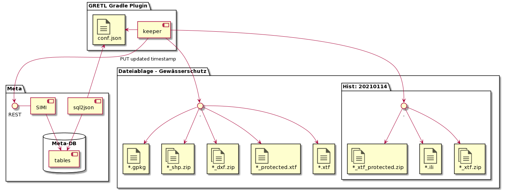

# Neue Komponenten der GRETL-Publikationsjobs

## Keeper

Um die aktuellen Daten dateibasiert anzubieten und historsiche Stände der Themen zu verwalten, wird GRETL um
die Komponente "keeper" erweitert.

Nach Abschluss der spezifischen Tasks eines Publikations-Jobs (Bsp: Db2Db Edit -> Pub) verrichtet der keeper generisch
die folgenden Arbeiten:
* Aktualisierung der Datendateien für alle Kanäle und alle Formate des Datenbezugs.
* Aktualisierung des "Kurzzeit-Archives" mit dem vorherigen Stand. Anwendung der Archivausdünnung. 

Der keeper sorgt also dafür, dass die Dateien des Datenbezugs und des Kurzzeit-Archivs stets aufgeräumt sind. Er ist
also der (House-)**keeper** das dateibasierten Geodatenangebotes der GDI-SO. 

Die für den keeper notwendigen Konfigurationsinformationen werden aus der Meta-DB via sql2json generiert.

## Keeper: Master-Data in Datei- oder Datenbank 

Der keeper konsumiert als "Master-Data-Input" fallabhängig Dateien oder Interlis-Schemen in den Geodatenbanken.
Bei Input aus den Interlis-Schemen generiert der keeper als Erstes mittels ili2pg das xtf. Die weiteren Schritte 
bei der Ableitung der "Nutzungsformate" verwenden das xtf und verlaufen darum für alle Vektordaten identisch.

