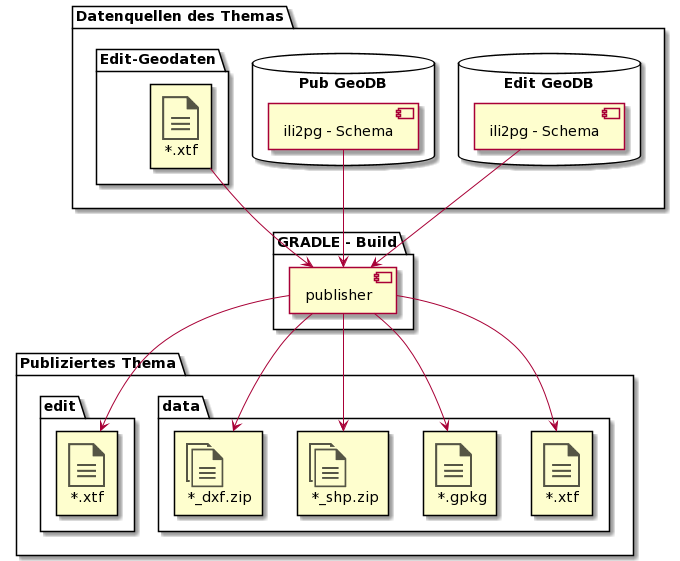

# Gradle-Plugin für die Datenpublikation: "Publisher"

## Ausführungszeitpunkt

Nach Abschluss der spezifischen Tasks eines Publikations-Jobs (Bsp: Db2Db Edit -> Pub) verrichtet der Publisher generisch die notwendigen Schritte zur Publikation
der aktualisierten Geodaten.

## Arten der publizierten Datenstrukturen

Die Geodaten eines Themas liegen meist in zwei Arten vor:

* **Edit:** Für die Nachführung strukturiert - Mit Beziehungen zwischen den Klassen, ohne Redundanzen.
* **Pub:** Für die einfache lesende Nutzung strukturiert - "Flachgeklopfte" Klassen ohne Beziehungen untereinander mit redundanten Informationen.

PUB für "Publikation" bezeichnet die für einfache Nutzung strukturierten Daten.
Mit dem Publikationsschritt (Ausführung des Publisher) werden sowohl die Edit- wie die Pub-Daten im Zeitstand "aktuell" abgelegt.

## Arbeitsweise

Der Publisher arbeitet die folgenden Hauptschritte ab:

* Verstecktes Verzeichnis für den Datenstand via FTPS erstellen (.yyyy.MM.dd/). Abbruch mit Fehler falls Verzeichnis vorhanden.
* XTFs in Verzeichnis ablegen.
  * Für Datenthemen mit Quelle=Datenbank: XTF-Transferdateien exportieren.
    * Aus Schema die zutreffende ili2pg-Version ermitteln, und mit dieser das xtf erzeugen.
    * Prüfung der xtf gegen das Modell. Abbruch bei fatalen Fehlern.
  * Für Datenthemen mit Quelle=XTF: XTF in Verzeichnis kopieren.
* Aus dem Publikations-xtf die Benutzerformate (Geopackage, Shapefile, ...) ableiten und ablegen.
* Metadaten sammeln und im Unterordner meta/ ablegen.
* Neue Ordnernamen setzen.
  * aktuell umbenennen auf Ordnername gemäss Datum in publishdate.json.
  * Verstecktes Verzeichnis umbenennen auf aktuell.
* Historische Stände ausdünnen.

[Aufbau der Ablage](file_pub/ablage_struktur.md)

Fragen:
* AGI
  * Sind wir für den Erstrelease auf das Publikationsdatum zwingend angewiesen? Soll dieses in der Webapplikation Datenbezug an prominenter Stelle angezeigt werden?
  * Es gibt keine Datenthemen, in denen wir Geopackage und co bereitstellen, die Datenquelle dafür aber nicht die Pub-DB, sondern ein abgelegtes xtf ist, oder?
  * Die Rasterdaten werden nicht automatisch, sondern manuell nach den gleichen Gesetzmässigkeiten wie die Vektoren abgelegt. Sie sind für den Publisher "out of scope".
* Wie gehen wir mit den parallel vorhandenen ili2pg Versionen um? 

