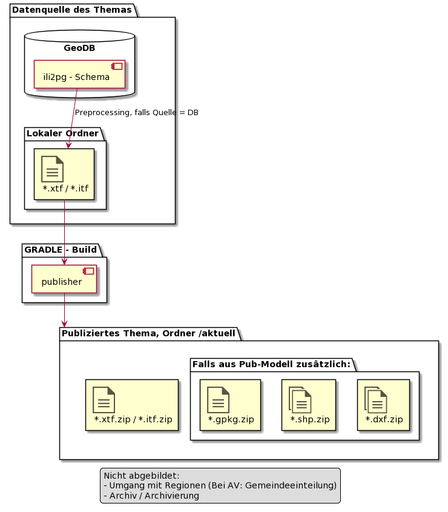

# Publisher-Task (GRETL)

## Einbindung in einen typischen GRETL-Publikationsjob

In den heute vorliegenden Publikationsjobs werden häufig die Daten vom relational aufgebauten Edit-Schema mittels SQL-Queries "flachgewalzt" und ins Pub-Schema kopiert. Die Schema-Struktur
wird automatisch mittels ili2pg aus Edit- und Pub-Modell generiert.

Für den Datenbezug wird das build.gradle mit zwei Aufrufen des neuen Publisher-Task ergänzt:

    defaultTasks 'pubProduct'

    task pubEdit(type: Publisher){
      publishTopics = [ch.so.avt.verkehrszaehlstellen.edit]
      ...
    }

    task transferVZS(type: Db2Db, dependsOn: pubEdit){
      ...
    }

    task pubProduct(type: Publisher, dependsOn: transferDenkmal){
      publishTopics = [ch.so.avt.verkehrszaehlstellen]
      ...
    }

Bei Problemen mit der Datenqualität der Originaldaten schlägt der Task "pubEdit" fehl. Der Job bricht mit Fehler ab, bevor die Daten irgendwo landen.

### Komplexere Fälle

**Nutzungsplanung**

In der Nutzungsplanung werden voraussichtlich im gleichen Job kommunale und kantonale Datenthemen publiziert:

1. Publisher: \[ch.so.arp.nutzungsplanung.**kommunal.edit**, ch.so.arp.nutzungsplanung.**kantonal.edit**\]
1. Datentransfers in Pub-Modell-Schemen
1. Publisher: \[ch.so.arp.nutzungsplanung.**kommunal**, ch.so.arp.nutzungsplanung.**kantonal**\]

**AV**

In der AV sind neben den Modellen DM01-SO und "Mo-Public" auch DM01-CH zu berücksichtigen.

1. Publisher: \[ch.so.agi.av.dm01_so\]
1. Datentransfer, Erstellung DM01-CH Transferdateien, ...
1. Publisher: \[ch.so.agi.av.dm01, ch.so.agi.av.mopublic\]

## Arbeitsschritte des Publisher-TASK (pro Datenbereitstellung)

* Falls Quelle = DB: Transferdatei(en) einer Datenbereitstellung erstellen und lokal ablegen (Mehrere pro Datenbereitstellung, falls die Daten wie in der AV in Regionen unterteilt sind) <!-- $td ili2pg zwei Versionen? -->
* Transferdatei(en) gegen Modell validieren <!-- $td immer validieren? -->
* Falls Pub-Modell: Generische Produkte ableiten (gpkg, shp, dxf) und lokal ablegen
* Metadaten sammeln und im Unterordner meta/ ablegen.
* Lokales Verzeichnis via sFTP in die Datenablage hochladen (\[datenbereitstellung\]/.yyyy.MM.dd). Abbruch mit Fehler falls Verzeichnis remote schon vorhanden.
* Neue Ordnernamen setzen.
  * aktuell umbenennen auf Ordnername gemäss Datum in meta/publishdate.json.
  * Verstecktes Verzeichnis umbenennen auf aktuell.
* Historische Stände ausdünnen.

### Datenfluss und Artefakte bei der Publikation einer Datenbereitstellung

## Links

* [Regionen](./regionen) zum Umgang mit Regionen
* [Ablagestruktur](../ablage_struktur) zum Aufbau der Ablage
