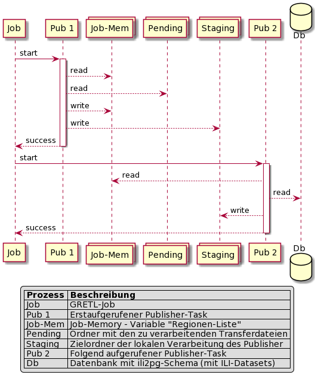

# Regionen-Publikation verteilt über mehrere Publisher-Task Aufrufe

Wie auf der Seite [Publisher-Task (GRETL)](../) beschrieben, wird typischerweise pro GRETL-Job der Publisher-Task mehrfach aufgerufen. Auf dieser Seite wird erläutert:

* Wie der erstausgeführte Publisher das Set der zu bearbeitenden Regionen ermittelt.
* Wie nachfolgend aufgerufene Publisher dieses Set für andere Datenbereitstellungen abarbeiten.

## Publikation am Beispiel der AV-Daten von Egerkingen und Oberbuchsiten

In der AV werden die BFS-Nummern als Identifier der Regionen genutzt. Die Identifier sind Teil der Dateinamen der Ablage (Namenskonvention).

### Publikationsschritte

* Pub 1 (erstausgeführter Publisher):
  * Aus den Dateinamen der Dateien im Ordner "pending" die Liste der zu verarbeitenden Regionen ableiten.
  * Liste in Job-Variable speichern.
  * Daten für ch.so.agi.av.dm01_so bereitstellen.
* Pub 2 (von Job folgend aufgerufener Publisher):
  * Regionen-Liste aus Job-Variable auslesen.
  * Transferdateien aus der Datenbank exportieren und bereitstellen (ch.so.agi.av.mopublic)
    * Voraussetzung: Das ili2pg-Schema wurde mit den korrekten ILI-Datasets angelegt (2401, 2406, ...)

Nach Pub 2 können beliebig viele weitere Publikations-Tasks folgen. Falls diese eine Datenbereitstellung mit Regionen behandeln, lesen sie wiederum die Regionen-Liste aus.
Für Pub 2 und alle folgenden ist die Regionen-Liste massgebend. Falls diesen in der Verarbeitung Dateien oder in der DB Datasets fehlen, brechen sie die Verarbeitung ab.

**Detailliertes Sequenzdiagramm der Schritte:**

Ein Publisher ermittelt durch das Auslesen der Regionen-Liste, ob er im Job der Erste ist:

* Regionen-Liste nicht vorhanden --> Erstausgeführter Publisher. Ermittelt Liste aus "pending" Ordner
* Regionen-Liste vorhanden --> Folgender Publisher. Arbeitet die vorhandene Regionen-Liste ab.

### Links

Siehe Kapitel "Abbildung von Regionen-Einteilungen" in [Datei- und Ordnerstruktur der Ablage](../../ablage_struktur) bezüglich des Aufbaus der Ablage.

Protokoll übersicht fragen publisher
- dm01_ch
- umwandlung publishdat.json in metainf.json, ergänzung mit Array der aktualisierten Regionen

