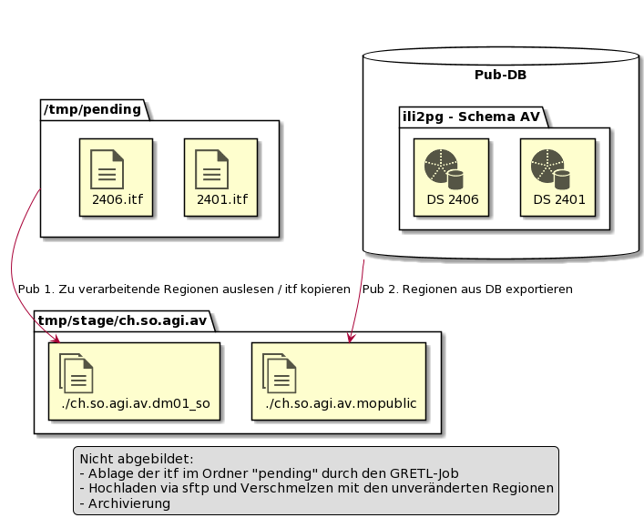

# Nachführungseinheiten

Folgende Beispiele erläutern Fälle mit mehreren Nachführungseinheiten innerhalb des Kantons Solothurn.

## Publikation der AV-Daten von Egerkingen und Oberbuchsiten

In der AV werden die BFS-Nummern als Identifier der Nachführungseinheiten genutzt. Die Identifier sind Teil der Datei- und Ordnernamen der Ablage.

### Publikationsschritte

* Vorgelagerte Schritte des Publikations-Job (Nicht abgebildet):
  * Ablage der zu aktualisierenden AV-Daten pro Gemeinde mit Namensgebung gemäss Konvention (BFS-Nr 2401, 2406 für Egerkingen, Oberbuchsiten).
  * Ableitung und Aktualisierung der Produkte in der Publikations-DB.
* Bereitstellung Zeitstand in Stage-Ordner durch Publisher-Task:
  1. 1:1 Kopie des aktuell publizierten AV-Datenstandes erstellen.
  2. Original Transferdateien Prüfen und in Staging ersetzen.
  3. Produkte pro Nachführungseinheit aktualisieren:     
    * Mittels ili2pg die Daten der betroffenen ili dataset (DS) aus DB exportieren.
    * Exportierte Transferdatei prüfen.
    * Nutzerformate ableiten und ablegen.
* Nachgelagerte Schritte des Publisher-Task (Nicht abgebildet):
  * Neuen Zeitstand mittels sftp publizieren.
  * Archiv ausdünnen.

Resultierende Ablage (todo verschieben in entsprechendes *.md):
* /stage/edit: **(Jeweils dm01 SO)**
  * 2401.itf.zip
  * 2402.itf.zip
  * ...
* /stage/data: 
  * ./2401: $td Ordner erwünscht?
    * **2401.itf.zip (dm01 CH)**
    * 2401.xtf.zip (mopublic)
    * **2401.dxf.zip**
    * **2401.dxf_geobau.zip**
    * 2401.shp.zip
    * 2401.gpkg.zip

  * ./2402:
    * ...

Fragen:
* Fett dargestellt
  * Die Nachführungsgeometer liefern dm01 SO, nicht CH?
  * Abgrenzung Edit / Pub bzgl dm01 CH?
  * AV sowohl in generischem dxf wie spezifischem (geobau)?

