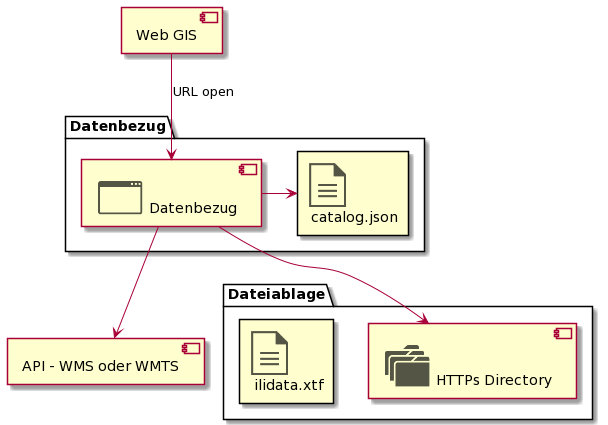

# Datenbezug (Web Client)

Die Webapplikation Datenbezug bezieht ihre Konfigurationsinformationen aus der Datei catalog.json, welche wiederum 
mittels sql2json Trafo aus der Meta-DB generiert wird (bei jedem Layer-Rollout).

