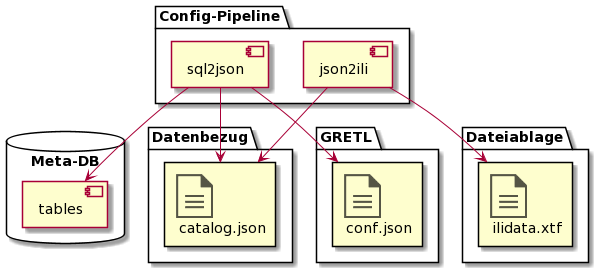

# Verteilung der Metainformationen

Die Config-Pipeline wird ergänzt mit:
* Weiteren Aufrufen des bestehenden sql2json.jar für die Erzeugung der *.json Dateien.
* Der neu erstellten Komponente json2ili, welche aus dem catalog.json das ilidata.xtf ableitet.