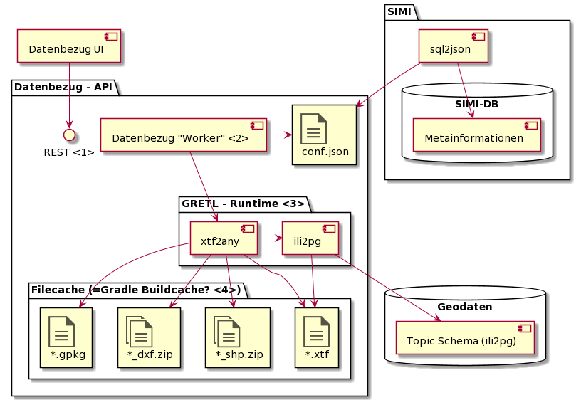

# Datenbezug - Komponentenübersicht

## Datenbezug - API

Bei diesem Ansatz wird davon ausgegangen, dass zumindest ein Teil der Dateien nicht die ganze Zeit

Mittels API werden Aufträge zur Erstellen / Aktualisieren eines Exports aufgegeben. Mittels 
Job-Referenz wird der Status des Auftrags abgefragt und schlussendlich der Pfad zur Ausgabedatei
zurückgegeben.

### <1> - Rest-Endpunkt

Request auf http://geo.so.ch/data/ch.so.agi.mopublic/[format] startet job (gradle build) und gibt die Job-ID zurück.

Request auf http://geo.so.ch/data/job/78fffb1f-1c3e-4de4-82d6-0c148d0089e6 gibt den Status der Dateibereitstellung
zurück:

* Queued
* Writing XTF
* Writing GPKG / SHP / DXF

Nach Abschluss wird der Download-Link zurückgegeben - etwa http://geo.so.ch/data/ch.so.agi.mopublic/xtf/20210114

### <2> - Worker als thin wrapper um die GRETL-Runtime

Einfacher im 

Fragen:
1. Die Api sollte auf einfache Weise ermöglichen:
   * Eine Datendatei (xtf, gpkg, shp.zip, ... anzufordern)
     * Falls Platz geschaffen werden muss: --> Alte Teile des Cache wegräumen
   * Pollen, ob die Bereitstellung abgeschlossen ist
   * Wenn abgeschlossen, den Downloadlink anbieten   
   Bei diesem Modell könnte sehr einfach ein unterschiedlich grosser File-Cache zum Einsatz kommen,
   welcher vollautomatisch die am meisten angeforderten Themen vorhält und damit die jeweilige 
   Wartezeit massiv verkürzt.   
   Nachteil des Ansatzes ist, dass sich ein "über alles" erstreckendes und jederzeit geladenes
   ftp-Verzeichnis kaum sinnvoll realisieren lässt.
   Ob und in welchem Umfang für die Umsetzung der API Jenkins gewinnbringend genutzt werden kann/soll,
   ist abzuklären.
1. Die Nutzung von GRADLE / GRETL erscheint sinnvoll:
   * Nutzung des Caching von Gradle, um schon generierte xtf, gpkg, ... nicht erneut zu generieren.   
   Hierzu ist zu klären, ob die dateibasierte Aenderungserkennung auch auf die grossen 
   Datenexport-Dateien angewendet werden kann.
   * "Untersuchbarkeit": Die einzelnen Tasks können separat via gradle ausgeführt werden
   * "Wiederverwendbarkeit": Die Funktionalitäten stehen als GRETL-Task auch für die Nutzung
   in anderem Kontext zur Verfügung. 
   