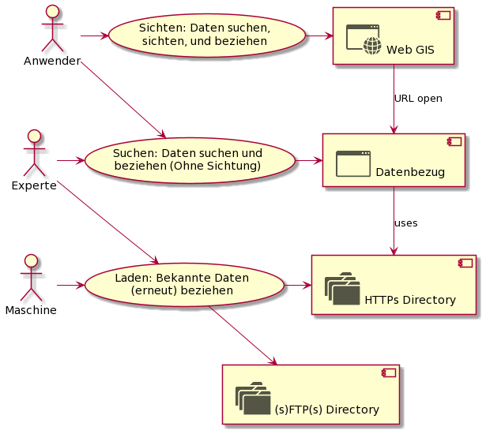

# Datenbezug - Grobkonzept

Folgend wird das Grobkonzept des SO!GIS 2.0 Umsetzungsprojektes "Datenbezug" beschrieben. Das Grobkonzept stellt
neben dem erstellten PMP die wichtigste Grundlage für den Phasenübergang in die Konzeptphase dar.

PMP:
* Marketing (Opendata)

## Kundensicht

"Kunden" des Datenbezugs sind sowohl Menschen wie auch Maschinen. Ob die Personen innerhalb oder ausserhalb der 
kantonalen Verwaltung arbeiten, ist nicht relevant und darf keinen Unterschied machen.

**Benutzer**: $td Beschreibung von ebp übertragen
* **Anwender:** Kann ein GIS im Bereich der für sein Fachgebiet notwendigen Funktionen anwenden. Hat aber bezüglich
  Geodatenformaten und Modellen kein fundiertes Wissen.
* **Experte:** Verfügt über fundiertes Wissen bezüglich Geodaten - Verwendet diese Beispielsweise als Inputs
  in eigenen automatisierten Datenverarbeitungsprozessen.
* **Maschine:** Bezieht automatisiert die aktuellsten Daten - ist dafür auf stabile URL's und Metainformationen 
  angewiesen. Etwa bezüglich dem Datum der letzten Aktualisierung eines Datensatzes.

**Anwendungsfälle:**
* **Sichten:** Hauptmerkmal dieses Anwendungsfalles ist das visuelle Sichten der Daten im Web GIS Client. Damit gewinnt
  der Benutzer auch visuell Gewissheit, dass es sich um die für ihn notwendigen Geodaten handelt.
* **Suchen:** Hauptmerkmal ist das Suchen und Finden der Datensätze mittels Volltextsuche. Im Gegensatz zum Anwendungsfall
  "Sichten" gibt es keine Datenvorschau in einer interaktiven Karte. 
* **Laden:** Hier geht es um direktes und schnelles Herunterladen von 1-n Datensätzen.
* **Kurzzeit-Archiv:** Stellt die historischen Stände 5 - 10 Jahre zurück bereit und bietet für die Datenbezüger ähnliche
  Funktionalität wie beim Bezug des aktuellen Datenstandes.
* **Langzeit-Archiv:** Stellt die historischen Stände über Dekaden sicher. Der Zugriff erfolgt über die Funktionalitäten
  des digitalen Archivs der Staatskanzlei.

## Komponentendiagramme
* [Neue Komponenten der GRETL Publikations-Jobs](gretl_pub.md)

## Glossar

* **Datensatz:** Menge an Datendateien, in welchen die Geodaten eines Themas vollständig enthalten sind. Bei Vektordaten
  sind dies alle in **einem** INTERLIS-Modell beschriebenen Daten.
* **Datenthema:** Siehe Thema.
* **Modell:** = INTERLIS-Modell.
* **Thema:** Fachthematisch eng gefasste Gruppe von Informationen. Ein Thema ist in **genau einem** Modell beschrieben
  und wird als **ein** Datensatz bezogen.
* **Publikations-Job:** GRETL-Job, mit welchem die Daten eines Themas von einem Editierstand publiziert werden.
* **GDI-SO:** Geodateninfrastruktur des Kantons Solothurn.

## Fragen / Feststellungen bzgl. der Konzeptphase

* Ausdetaillierung bezüglich der nicht vektoriellen Daten: In welchen Aspekten können diese nicht gleich behandelt
  werden wie die Vektordaten? 
* Integrierte Suche vs. Nutzen des Suchservice.
* Zugriffsschutz: Wie wird dieser über alle Kanäle umgesetzt (http / ftp)? Die Informationen dazu sind vorhanden und
  können via json.
* Gefühlt sind unsere Beschreibungen noch am falschen Ort / an zu vielen Orten. Fokus liegt im Moment noch stark
  auf der Beschreibung einzelner Tabellen, und nicht auf der Beschreibung des ganzen Themas als "Tabellenverbund".
* Kann die Fragestellung des Massendownloads in einem Browser gelöst werden und falls ja wie? Dies würde bei nach
  Gebieten aufgeteilten Daten eine massive Verbesserung der Benutzerinteraktion ermöglichen.
* Aspekte des keepers weiter ausdetaillieren, damit dessen interne Struktur von den Entwicklern definiert werden kann.
* Wieviel Platz kann in den historisierten Ständen durch zippen der xtf gespart werden? Rechnet sich das?
* Wie wird auf http / ftp sichergestellt, dass eine Datenaktualisierung (fast) transaktional erfolgt?
  * Ordner umbenennen?
  * "Virtuelle" Verzeichnisse (Pointer)?
* Welche Technologie kommt sinnvollerweise für sicheren FTP zum Einsatz? sFTP oder FTPs?
* Regeln für die Historisierung und deren Anwendung: 
  * Soll / Muss das Archiv auch ausgedünnt werden? (Sliding Window) etwa:
    * Bis drei Monate zurück: Wochenstände werden bereitgestellt (sofern vorhanden)
    * Drei bis zwölf Monate zurück: Monatsstände werden bereitgestellt
    * Mehr als ein Jahr zurück: Jahresstände werden bereitgestellt
  * Ist es richtig, dass die Anwendung zum Zeitpunkt der Publikation über den Keeper erfolgt? Alternative: 
  Scheduled background Task.
* Gibt es manuelle Tätigkeiten im Kontext der Datenpublikation und können diese durch die Funktionalitäten des keepers
  unterstützt werden? Raster? Lidar?
  
## Entscheide

* **Geschützte Attribute:** Diese werden in SIMI (und nicht mittels Annotation im Modell) geführt. Grund: Die Zugriffs-
Definition erfolgt über DataSetView, Rollen, Gruppen und Benutzer. Diese liegen alle in SIMI "integer und ganzheitlich" vor.
Das Nutzen der Annotations würde ein Verteilen der Master-Daten bedingen, mit Verlust der Unterstützung der 
wichtigen referenziellen Integrität, welche uns die SIMI-DB "schenkt".  
* **Langzeit-Archiv:** Die zusammen mit dem Staatsarchiv zu lösende Frage der Langzeitarchivierung ist "out of scope".
  In scope ist hingegen die Umsetzung der Empfehlungen, wie die Daten und Metadaten für die Langzeitarchivierung
  packetiert werden sollen.
  
