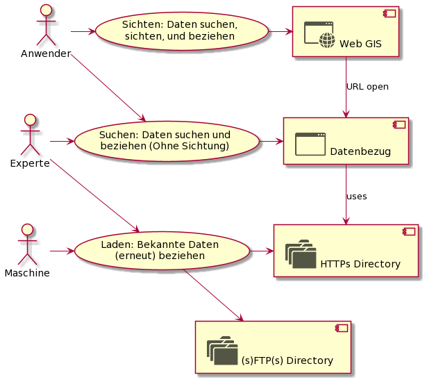

# Datenbezug - Grobkonzept

Folgend wird das Grobkonzept des SO!GIS 2.0 Umsetzungsprojektes "Datenbezug" beschrieben. Das Grobkonzept stellt
neben dem erstellten PMP die wichtigste Grundlage für den Phasenübergang in die Konzeptphase dar.

## Kundensicht

"Kunden" des Datenbezugs sind sowohl Menschen wie auch Maschinen. Ob die Personen innerhalb oder ausserhalb der 
kantonalen Verwaltung arbeiten, ist nicht relevant und darf keinen Unterschied machen.

**Benutzer**:
* **Anwender:** Kann ein Desktop-GIS im Bereich der für sein Fachgebiet notwendigen Funktionen anwenden. Hat aber bezüglich
  Geodatenformaten und Modellen kein fundiertes Wissen.
* **Experte:** Verfügt über fundiertes Wissen bezüglich Geodaten - Verwendet diese Beispielsweise als Inputs
  in eigenen automatisierten Datenverarbeitungsprozessen.
* **Maschine:** Bezieht automatisiert die aktuellsten Daten - ist dafür auf stabile URL's und Metainformationen 
  angewiesen. Etwa bezüglich dem Datum der letzten Aktualisierung eines Datensatzes.

**Anwendungsfälle:**
* **Sichten:** Hauptmerkmal dieses Anwendungsfalles ist das visuelle Sichten der Daten im Web GIS Client. Damit gewinnt
  der Benutzer auch visuell Gewissheit, dass es sich um die für ihn notwendigen Geodaten handelt.
* **Suchen:** Hauptmerkmal ist das Suchen und Finden der Datensätze mittels Volltextsuche. Im Gegensatz zum Anwendungsfall
  "Sichten" gibt es keine Datenvorschau in einer interaktiven Karte. 
* **Laden:** Hier geht es um direktes und schnelles Herunterladen von 1-n Datensätzen.
* **Kurzzeit-Archiv:** Stellt die historischen Stände 5 - 10 Jahre zurück bereit und bietet für die Datenbezüger ähnliche
  Funktionalität wie beim Bezug des aktuellen Datenstandes.
* **Langzeit-Archiv:** Stellt die historischen Stände über Dekaden sicher. Der Zugriff erfolgt über die Funktionalitäten
  des digitalen Archivs des Staatsarchives.

## Komponentendiagramme
* [Verteilung der Metainformationen](conf.md)
* [Neue Komponenten der GRETL Publikations-Jobs](gretl_pub.md)
* [Komponenten rund um die Webapplikation "Datenbezug"](bezug.md)
* [Access-Management (Bouncer)](bouncer.md)

## Glossar

* **Datensatz:** Menge an Datendateien, in welchen die Geodaten eines Themas vollständig enthalten sind. Bei Vektordaten
  sind dies alle in **genau einem** INTERLIS-Modell beschriebenen Daten.
* **Datenthema:** Siehe Thema.
* **Modell:** = INTERLIS-Modell.
* **Thema:** Fachthematisch eng gefasste Gruppe von Informationen. Ein Thema ist in **genau einem** Modell beschrieben
  und wird als **ein** Datensatz bezogen.
* **Publikations-Job:** GRETL-Job, mit welchem die Daten eines Themas von einem Editierstand publiziert werden.
* **GDI-SO:** Geodateninfrastruktur des Kantons Solothurn.
* **Keeper:** Neue in das Gradle-Plugin GRETL integrierte Komponente, welche die Daten-Dateien für Datenbezug und 
  Kurzzeit-Archiv generiert.

## Fragen / Feststellungen bzgl. der Konzeptphase

* Ausdetaillierung bezüglich der nicht vektoriellen Daten: In welchen Aspekten können diese nicht gleich behandelt
  werden wie die Vektordaten? 
* Integrierte Suche vs. Nutzen des Suchservice.
* Gefühlt sind unsere Beschreibungen noch am falschen Ort / an zu vielen Orten. Fokus liegt im Moment noch stark
  auf der Beschreibung einzelner Tabellen, und nicht auf der Beschreibung des ganzen Themas als "Tabellenverbund".
* Aspekte des keepers weiter ausdetaillieren, damit dessen interne Struktur von den Entwicklern definiert werden kann.
* Wieviel Platz kann in den historisierten Ständen durch zippen der xtf gespart werden? Rechnet sich das?
* Regeln für die Historisierung und deren Anwendung: 
  * Soll / Muss das Archiv auch ausgedünnt werden? (Sliding Window) etwa:
    * Bis drei Monate zurück: Wochenstände werden bereitgestellt (sofern vorhanden)
    * Drei bis zwölf Monate zurück: Monatsstände werden bereitgestellt
    * Mehr als ein Jahr zurück: Jahresstände werden bereitgestellt
  * Ist es richtig, dass die Anwendung zum Zeitpunkt der Publikation über den Keeper erfolgt? Alternative: 
  Scheduled background Task.
* Gibt es manuelle Tätigkeiten im Kontext der Datenpublikation und können diese durch die Funktionalitäten des keepers
  unterstützt werden? Raster? Lidar?
* Das immer wichtiger werdende Datenthema ist Stand heute in WMS und WGC nicht durchgängig vorhanden. Muss dies in einer
  geeigneten Form nun gemacht werden? Beispielsweise indem immer ein Group- oder Facadelayer existiert, welcher das
  Datenthema repräsentiert?
* DONE: Ist es sinnvoll, den Katalog neben Json auch in INTERLIS-XML Form bereitzustellen? Aufwand / Ertrag?
  *  Strategie-Chefentscheid: Wird umgesetzt, auch um den interessanten Ansatz des ilidata.xtf zu unterstützen. 
* Andere Kantone machen eine grosse Sache von wegen OGD - was machen wir da kommunikativ?
* Bezüglich Dateiablage (AIO)
  * Zugriffsschutz: Wie wird dieser über alle Kanäle umgesetzt (http / ftp)? Die Informationen dazu sind vorhanden und
    können via catalog.json konsumiert werden.
  * Wie wird auf http / ftp sichergestellt, dass eine Datenaktualisierung (fast) transaktional erfolgt?
    * Ordner umbenennen?
    * "Virtuelle" Verzeichnisse (Pointer)?
  * Welche Technologie kommt sinnvollerweise für sicheren FTP zum Einsatz? sFTP oder FTPs?
  * Ueber welches Protokoll kann/soll der keeper die Kopieraktionen in der Dateiablage auslösen? (s)FTP(s)?
* In welchem Umfang wird das Archiv ebenfalls in die Benutzeroberfläche des Datenbezugs integriert?
* Welche Parameter übergibt der WGC dem Datenbezug via URL.
* Wie werden die nur für eine kleine Benutzergruppe interessanten Edit-Daten in der Datenbezug-Webapp angeboten?
* Eignet sich das "out of the box" REST-API von SIMI für die Aktualisierung mit dem "updated" timestamp, oder 
  muss/soll (mit wenig code) ein spezifischer Endpunkt geschrieben werden?
* Es müssen insbesondere die "Cornercases" Raster, AV und Nutzungsplanung untersucht werden, damit in der Konzeptphase
  ein vollständiges Bild entsteht.
  * Raster: Aufgrund ihres generell anderen Charakters (Datenumfang, Kachelung, .....)
  * AV (Nutzungsplanung): Vektor Datenthemen mit Originaldaten in n Xtf's
* Datenbezug-Client: Wie wird UXUI gestaltet, um die Filterung der Datenthemen gemäss "WGC Auswahl" zum Ausdruck zu bringen?
* Subunits: Wo werden diese wie definiert? In SIMI, als INTERLIS-Modell, ...? 
* Subunits: Wie werden sie dem Datenbezug-Client verfügbar gemacht, damit er diese anzeigen und selektieren kann? Via catalog.json, WMS, ...?
* Kommunikation: In welcher Form kann vor allem kantonsintern aufgezeigt werden, dass das AGI einen guten Job macht und die 
  Geodaten im Kanton Solothurn seit XX Jahren open sind. --> Opengeodata
* Opengeodata: In diesem Zuge die mini-Anpassung noch machen ("Lizenzvertrag"), damit offene Geodaten == Opendata?
* Trace: Welche Statistiken sind sinnvoll bezüglich dem Datenbezug und wie kommen wir zu diesen?
* Ist die Maskierung für die zugriffsgeschützten Attribute eines Interlis-Modelles ein guter Weg, und wie gelangt diese
  Information zu ili2pg? Parameter des ili2pg Aufrufes, Annotation auf den betroffenen Modellen, ...?
* Wie gehen wir mit den parallel vorhandenen ili2pg Versionen um? 
  
## Entscheide

* **Geschützte Attribute:** Diese werden in SIMI (und nicht mittels Annotation im Modell) geführt. Grund: Die 
  Zugriffsdefinition erfolgt über DataSetView, Rollen, Gruppen und Benutzer. Diese liegen alle in SIMI "integer und ganzheitlich" vor.
  Das Nutzen der Annotations würde ein Verteilen der Master-Daten bedingen, mit Verlust der Unterstützung der 
  wichtigen referenziellen Integrität, welche uns die SIMI-DB "schenkt".  
* **Langzeit-Archiv:** Die zusammen mit dem Staatsarchiv zu lösende Frage der Langzeitarchivierung ist "out of scope".
  In scope ist hingegen die Umsetzung der Empfehlungen, wie die Daten und Metadaten für die Langzeitarchivierung
  packetiert werden sollen.    
  (--> Siehe Resultate des Projektes ellipse des Bundes. Aktuellsten Stand telefonisch nachfragen).
* **STAC-API:** Das STAC-API ist ein interessanter Ansatz für die Bereitstellung von Datendateien. Von den für das API
  notwendigen Informationen passt es gut zum Datenbezug. Zum heutigen Zeitpunkt ist nicht klar, ob sich das STAC API,
  AtOS (Atom Open Search) oder ein anderer Ansatz durchsetzen wird. Darum: Out of Scope - in Folgeprojekt umsetzen, 
  falls sich STAC als Standard durchsetzt.
* **Mehrfach download:** Dieser absehbare Kundenwunsch beisst sich sehr mit den HTTP / Browser Limitationen.
  --> Leider "out of scope". Abhängig von den Kundenfeedbacks nach mehreren Monaten Betrieb Lösung suchen. Ansätze:
  * https://github.com/sindresorhus/multi-download
  * https://stackoverflow.com/questions/7064998/how-to-make-a-link-open-multiple-pages-when-clicked
* **Geocat:** Die Geocat-Anbindung wird sinnvollerweise in einem eigenständigen Projekt angegangen. Die Anbindung
  mittels INTERLIS ist unsere Kernkompetenz. Die dafür notwendigen Komponenten existieren mit GRETL und 
  ili2pg schon lange.   
  --> Projekt wird in unsere Projekt-Queue aufgenommen. Dieses Projekt würde sich auch hervorragend
  eignen für die Erarbeitung durch einen Projektleiter ausserhalb des AGI (--> AIO oder Extern).
  
  
