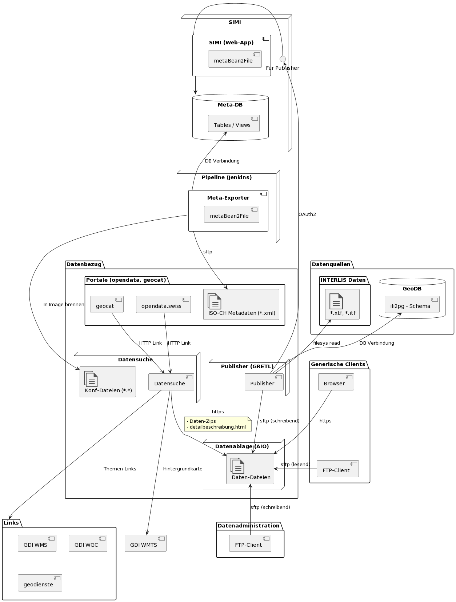

# Datenbezug
Verantwortlicher: [Vorname] [Name]

Umfasst die Komponenten und Schnittstellen, mit welchen die öffentlichen Geodaten dateibasiert bereitgestellt werden.

## Komponenten

* **Publisher:** GRETL-Task, welcher als letzen Schritt der Datenpublikation für Vektordaten die aktuellsten Geodaten-Dateien bereitstellt und das Archiv der vorherigen Zeitstände pflegt.
* **Datensuche:** Webapplikation zum Suchen und Herunterladen der Geodaten mit einfach verständlicher Benutzeroberfläche.
* **Datenablage:** Strukturierte und für fortgeschrittene Benutzer selbsterklärende Datenablage. Fortgeschrittene Benutzer und automatisierte Datenprozesse beziehen die Datendateien direkt via HTTPS und anonymem FTP.

## Technische Anwendungsfälle

Abhängig von Geodatentyp, -Quelle und Regioneneinteilung werden die Daten automatisch oder manuell bereitgestellt:

|Typ|Quelle|Einteilung|Orig|Prod|Beispiel|
|---|---|---|---|---|---|
|Vec|DB|SO|auto|auto|Gewässerschutz|
|Vec|Datei|SO|-|auto|KBS|
|Vec|Datei|Sub-SO|auto|auto|AV|
|Vec|DB|Sub-SO|-|manu|Höhenlinien (Lidar)|
|Non-Vec|Datei|SO|-|manu|Hochwasserschutz Emme|
|Non-Vec|Datei|Sub-SO|-|manu|DTM (Lidar)|

Todo weitere Kapitel (aus Vorlage):

* Benutzung
* Konfigurieren und starten
* Externe Abhängigkeiten
* Konfiguration und Betrieb in der GDI

* Interne Struktur